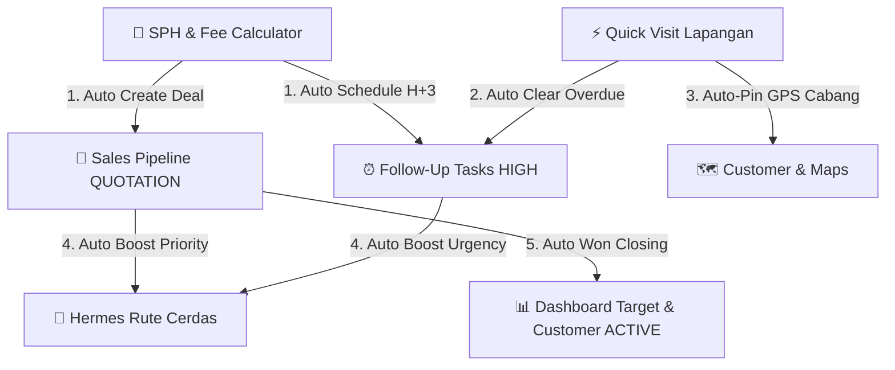

# Checkpoint 22 — DSR360 (Phase 6 / SPH Generator & 5-Pillar Cross-Tab Autonomous Ecosystem)

**Timestamp:** 27 Agustus 2026, 02:35 WIB  
**Status:** ✅ Complete, Verified, & Built (0 Lint / TS / Build Errors)

---

## 1. Executive Summary

Di checkpoint ini, DSR360 telah berevolusi menjadi super-app sales B2B yang sepenuhnya otonom. Tidak hanya menyelesaikan kendala kalkulasi harga dan birokrasi SPH kantor yang memakan waktu, sistem kini menghubungkan seluruh modul aplikasi secara **Cross-Tab Autonomous** sehingga setiap aksi di satu fitur langsung mengalirkan data ke fitur lainnya.

---

## 2. Fitur Utama yang Diselesaikan

### A. Smart Price & Fee Calculator + Official Shell Database (`/calculator`)
1. **Master Database 223+ SKU Shell Indonesia**:
   - Dilengkapi harga dasar (MSP), klasifikasi kemasan (`DRUM 209L`, `PAIL 20L`, `BULK`, `GALON 4L`, dll.), serta deskripsi industri resmi.
2. **Dual-Mode Compensation Engine**:
   - **Mode 1: Skema Fee Pihak Ketiga**:
     $$\text{Floor Price} = \text{ROUNDUP}\left(\text{MSP} + \frac{\text{Fee}}{0.52}, 0\right)$$
     $$\text{PPh Selisih} = \text{ROUNDUP}\left(\frac{\text{Subtotal Jual} - \text{Subtotal MSP}}{1.11} \times 0.25, 0\right)$$
   - **Mode 2: Skema Insentif TER DSR (Golongan 1 s/d 7)**:
     - Dihitung dari margin harga jual terhadap MSP (0% hingga 3.00% MSP).
3. **Product Search Combobox**:
   - Autocomplete instan dengan multi-token fuzzy search dan dukungan custom SKU manual.

---

### B. Authentic SPH Template & Isolated Print Engine
1. **100% Identik dengan Template Resmi Kantor PT Harapan Utama Motor**:
   - **Kop Surat Header**: Logo PT HUM + Banner merah NPWP & Alamat Sukoharjo.
   - **Nomor Surat Format Romawi**: `[Seq]/HUM/SPH/[Roman_Month]/[Year]`.
   - **Tabel 6 Kolom**: `No` | `Nama Produk` | `Deskripsi Produk` | `Pack` | `Unit` | `Price/Unit`.
   - **Klausul Ketentuan Resmi (❖)**: Toggle interaktif PPN (SUDAH/BELUM), Franco, Pembayaran (TOP).
   - **Tanda Tangan & Cap Asli Bima Maulana Saputra**: Menggunakan stempel `PT. HARAPAN UTAMA MOTOR SOLO` dengan transparansi alpha (`/images/sph/bima_signature_stamp.png`).
   - **Footer Banner Full-Width**: Membentang penuh memuat alamat cabang Solo, Bandung, dan logo Shell Lubricants Authorised Distributor.
2. **Isolated Print Sandbox**:
   - Menghilangkan 100% bleed UI/background modal.
   - Dialog cetak browser langsung menghasilkan **1 lembar A4 portrait presisi & bersih**.

---

### C. 5-Pillar Cross-Tab Autonomous Sales Ecosystem

1. **Alur 1: SPH ➔ Auto Create Pipeline & Auto Schedule Follow-Up H+3**:
   - Menyimpan SPH otomatis membuat opportunity tahap `QUOTATION` dan menjadwalkan task follow-up di `/follow-ups` dengan due date H+3.
2. **Alur 2: Quick Visit Lapangan ➔ Auto Clear Overdue Follow-Ups**:
   - Kunjungan lapangan otomatis menandai seluruh tugas follow-up/overdue lama customer tersebut sebagai `COMPLETED`.
3. **Alur 3: Live GPS Check-in ➔ Auto-Pin Koordinat Cabang Customer**:
   - Koordinat GPS saat visit otomatis tersimpan ke profil customer dan cabang maps yang masih kosong.
4. **Alur 4: Hermes Rute Cerdas ➔ Prioritas Otomatis Deal SPH & Overdue**:
   - Hermes memprioritaskan customer yang memiliki deal SPH aktif (+40 skor) atau follow-up overdue (+45 skor) di jalur rute harian.
5. **Alur 5: Deal WON Closing ➔ Auto Upgrade Customer Status to ACTIVE**:
   - Saat deal dimenangkan (`WON`), status akun customer otomatis naik ke `ACTIVE` dan volume bulanan terbarui.

---

## 3. File Inventory

| Path File | Fungsi & Peran |
|---|---|
| [`actions/sph-calculator.ts`](file:///c:/Users/bimam/Downloads/dsr360-phase4-fix2/dsr360/actions/sph-calculator.ts) | Server action nomor SPH, customer data, auto create deal & follow-up H+3 |
| [`actions/route-optimizer.ts`](file:///c:/Users/bimam/Downloads/dsr360-phase4-fix2/dsr360/actions/route-optimizer.ts) | Territory route planning dengan integrasi follow-up overdue & deal SPH |
| [`actions/visits.ts`](file:///c:/Users/bimam/Downloads/dsr360-phase4-fix2/dsr360/actions/visits.ts) | Quick visit & visit log dengan auto-clear follow-up & auto-pin GPS cabang |
| [`actions/opportunities.ts`](file:///c:/Users/bimam/Downloads/dsr360-phase4-fix2/dsr360/actions/opportunities.ts) | Pipeline management dengan customer auto-upgrade on deal WON |
| [`lib/constants/shell-pricing-database.ts`](file:///c:/Users/bimam/Downloads/dsr360-phase4-fix2/dsr360/lib/constants/shell-pricing-database.ts) | Database 223+ Shell SKUs, rumus Floor Price, PPh Selisih, & TER Gol 1-7 |
| [`lib/utils/geo-route.ts`](file:///c:/Users/bimam/Downloads/dsr360-phase4-fix2/dsr360/lib/utils/geo-route.ts) | Algoritma Haversine & Route candidate scoring terbobot deal & overdue |
| [`components/calculator/sph-document-preview-modal.tsx`](file:///c:/Users/bimam/Downloads/dsr360-phase4-fix2/dsr360/components/calculator/sph-document-preview-modal.tsx) | Isolated A4 print sandbox & SPH document preview dengan Bima stamp |
| [`components/calculator/price-fee-calculator-client.tsx`](file:///c:/Users/bimam/Downloads/dsr360-phase4-fix2/dsr360/components/calculator/price-fee-calculator-client.tsx) | UI interaktif kalkulator harga, fee presets, & pipeline deal saver |
| [`components/visits/smart-route-planner-client.tsx`](file:///c:/Users/bimam/Downloads/dsr360-phase4-fix2/dsr360/components/visits/smart-route-planner-client.tsx) | UI Hermes Rute Cerdas dengan visual badge Deal SPH & Overdue task |
| [`components/visits/quick-visit-form.tsx`](file:///c:/Users/bimam/Downloads/dsr360-phase4-fix2/dsr360/components/visits/quick-visit-form.tsx) | Quick visit lapangan dengan auto acquisition browser GPS coordinates |
| [`public/images/sph/bima_signature_stamp.png`](file:///c:/Users/bimam/Downloads/dsr360-phase4-fix2/dsr360/public/images/sph/bima_signature_stamp.png) | Aset stempel resmi PT HUM SOLO & tanda tangan Bima Maulana Saputra |
| [`public/images/sph/official_header_complete.png`](file:///c:/Users/bimam/Downloads/dsr360-phase4-fix2/dsr360/public/images/sph/official_header_complete.png) | Kop surat atas resmi lengkap dengan NPWP & Alamat Sukoharjo |
| [`public/images/sph/official_footer_complete.png`](file:///c:/Users/bimam/Downloads/dsr360-phase4-fix2/dsr360/public/images/sph/official_footer_complete.png) | Footer bawah resmi full-width Solo, Bandung, & Shell Authorised Distributor |

---

## 4. Status Verifikasi

- **Next.js Production Build**: `Passed (Exit Code 0)`
- **TypeScript Static Analysis**: `0 Errors`
- **Isolated A4 Print Engine**: `Tested & Verified (1 Lembar Pas)`
