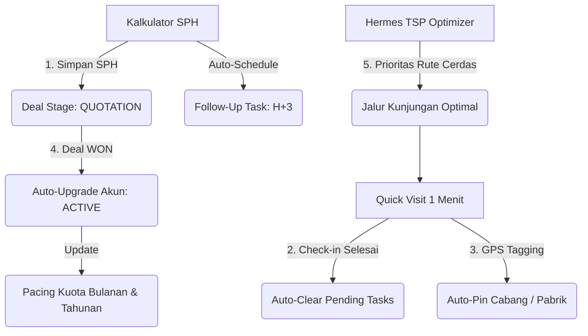

# 01 - Arsitektur & 5 Pilar Otomasi

#architecture #automation #workflows #crm #dsr360

---

## 🏗️ Diagram Ekosistem 5 Pilar Otomasi

---

## ⚡ Rincian 5 Pilar Otomasi

### Pilar 1: SPH ➔ Pipeline & Follow-Up Otomatis
* **Aksi:** DSR menekan tombol *"Simpan & Buat SPH"* pada Kalkulator Harga.
* **Otomasi:**
  1. Record baru dibuat di tabel `sph_quotations` dengan status `SENT`.
  2. Deal baru otomatis terbuat di tabel `opportunities` pada tahap `QUOTATION` dengan nilai Rupiah & estimasi volume Liter/Drum.
  3. Task follow-up otomatis dijadwalkan pada tabel `follow_ups` untuk tanggal **H+3** dengan reminder aksi: *"Follow-up respon penawaran SPH nomor [No SPH]"*.

### Pilar 2: Quick Visit ➔ Auto-Clear Follow-Up
* **Aksi:** DSR mencatat kunjungan lapangan via menu *Quick Visit (1 Menit)* atau *Log Kunjungan Detail*.
* **Otomasi:**
  - Seluruh task follow-up untuk customer tersebut yang berstatus `PENDING` atau sudah `OVERDUE` otomatis diubah statusnya menjadi `COMPLETED` dengan catatan riwayat terselesaikan via kunjungan terbaru.

### Pilar 3: Live GPS Check-in ➔ Auto-Pin Cabang
* **Aksi:** DSR melakukan check-in saat berada di pabrik atau gudang customer.
* **Otomasi:**
  - Koordinat Latitude & Longitude real-time perangkat DSR ditangkap dan otomatis disimpan ke entitas customer / daftar cabang (`customer_branches`).
  - Membantu DSR lain atau manajer melihat lokasi akurat titik bongkar muat drum di Google Maps & Waze.

### Pilar 4: Hermes Rute Cerdas ➔ Intelligent Prioritization (TSP)
* **Aksi:** DSR membuka *Territory Route & Quota Optimizer*.
* **Otomasi:**
  - Algoritma **TSP (Traveling Salesperson Problem)** dengan Haversine Distance Matrix memprioritaskan akun dengan:
    1. Status **Prioritas A** (Volume tinggi / kuota besar).
    2. Deal aktif pada tahap `QUOTATION` atau `NEGOTIATION`.
    3. Tugas follow-up yang sudah lewat batas (*overdue*).
  - Menghasilkan urutan rute dengan jarak tempuh minimum dan 1-klik navigasi ke Google Maps / Waze.

### Pilar 5: Deal WON ➔ Auto Customer Upgrade & Quota Pacing
* **Aksi:** Opportunity diubah statusnya menjadi `WON`.
* **Otomasi:**
  1. Status customer otomatis di-upgrade menjadi `ACTIVE`.
  2. Volume drum/liter yang terjual otomatis dialokasikan ke pencapaian kuota bulanan (`monthlyWonVolume`) dan tahunan (`annualWonVolume`).
  3. Radial pacing gauge di dashboard langsung memperbarui rasio pencapaian target.

---
[[Welcome]] | [[00 - Project Overview & Memory Index]] | [[02 - Database Schema & Supabase RLS]]
