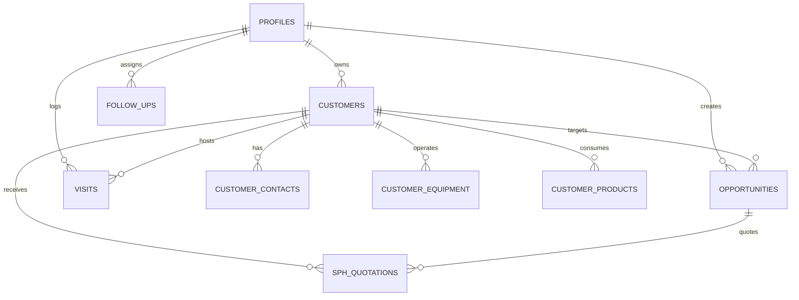

# 02 - Database Schema & Supabase RLS

#database #supabase #postgres #security #rls

---

## 🗄️ Entitas Utama & Struktur Tabel

---

## 📋 Rincian Skema Tabel

### 1. `profiles`
Tabel data profil DSR dan Manager terhubung ke `auth.users(id)`:
* `id` (`uuid`, PK): Primary Key terhubung ke Supabase Auth.
* `full_name` (`text`): Nama lengkap DSR/Manager.
* `role` (`user_role`): `DSR`, `SPV`, `MANAGER`, `ADMIN`.
* `sales_area` (`text`): Area wilayah kerja (cth: `Jawa Barat`, `Bandung`, `Sukabumi`, `Subang`).
* `annual_quota_liter` (`numeric`): Target kuota tahunan personal (contoh: 50.000 L/tahun, 78.000 L/tahun).
* `monthly_quota_liter` (`numeric`): Target kuota bulanan personal (contoh: 4.521 L/bulan, 6.500 L/bulan).
* `phone` (`text`): Nomor telepon kontak.
* `is_active` (`boolean`): Status keaktifan akun.

> [!NOTE]
> **Keputusan Arsitektur:** Kolom `annual_quota_liter` & `monthly_quota_liter` dipindahkan ke tabel `profiles` (terlindungi RLS) untuk menghapus seluruh hardcode PII dari repositori publik.

### 2. `customers`
Data akun manufaktur dan pelanggan B2B:
* `id` (`uuid`, PK)
* `customer_name` (`text`): Nama resmi perusahaan (cth: `PT Ewindo`, `PT Indocement`).
* `status` (`customer_status`): `PROSPECT`, `ACTIVE`, `INACTIVE`, `LOST`.
* `priority` (`priority_tier`): `A` (Tier 1 >10 Drum/bln), `B` (Tier 2 3-10 Drum/bln), `C` (Tier 3 <3 Drum/bln).
* `potential_monthly_volume` (`numeric`): Total kebutuhan pelumas bulanan (Liter/Bulan).
* `city`, `address`, `latitude`, `longitude` (`text`/`numeric`): Lokasi pabrik & koordinat GPS.
* `branches` (`jsonb`): Daftar cabang/pabrik satelit beserta kontak PIC lokasi.
* `owner_id` (`uuid`, FK ➔ `profiles.id`): DSR penanggung jawab akun.

### 3. `opportunities` (Pipeline Deals)
* `id` (`uuid`, PK)
* `customer_id` (`uuid`, FK ➔ `customers.id`)
* `opportunity_name` (`text`)
* `stage` (`opportunity_stage`): `PROSPECT`, `QUALIFIED`, `PRESENTATION`, `TRIAL`, `QUOTATION`, `NEGOTIATION`, `WON`, `LOST`.
* `potential_value` (`numeric`): Nilai estimasi deal (Rupiah).
* `potential_volume` (`numeric`): Estimasi volume deal (Liter).
* `product_items` (`jsonb`): Array item produk yang ditawarkan beserta harga satuan dan fee.
* `created_by` (`uuid`, FK ➔ `profiles.id`)

### 4. `sph_quotations`
Surat Penawaran Harga resmi PT HUM:
* `id` (`uuid`, PK)
* `sph_number` (`text`): Nomor surat unik resmi (Format: `SPH/DSR/HUM/YYYY/MM/XXXX`).
* `customer_id` (`uuid`, FK ➔ `customers.id`)
* `opportunity_id` (`uuid`, FK ➔ `opportunities.id`, nullable)
* `total_value` (`numeric`): Total nilai penawaran (Gross IDR).
* `ppn_inclusive` (`boolean`): Status apakah harga sudah include PPN 11%.
* `payment_term` (`text`): Termin TOP (cth: `30 Hari Kalender`, `CBD`, `COD`).
* `franco_location` (`text`): Lokasi serah terima barang.
* `items` (`jsonb`): Daftar SKU, volume pack (Drum/Pail), harga floor price, fee per unit.
* `approval_status` (`text`): `PENDING_REVIEW`, `APPROVED`, `REJECTED`.

### 5. `visits` & `follow_ups`
* **`visits`:** Kunjungan lapangan dengan data POPSA (`purpose`, `objective`, `premises`, `strategy`, `anticipate`), tipe kunjungan (`REGULAR`, `AUDIT`, `EMERGENCY`, `CLOSING`), checklist foto mesin/drum, dan respon pelanggan.
* **`follow_ups`:** Task pengingat aksi lanjutan dengan batas waktu (`due_date`), prioritas (`HIGH`, `MEDIUM`, `LOW`), dan status (`PENDING`, `COMPLETED`).

---

## 🔒 Kebijakan Row Level Security (RLS)
1. **DSR Access:** DSR hanya dapat mengedit customer, opportunity, dan visit yang dimiliki (`owner_id = auth.uid()` atau `created_by = auth.uid()`), namun dapat melihat daftar akun perusahaan untuk menghindari double-prospecting.
2. **Manager / Admin Access:** Memiliki hak penuh untuk melihat seluruh deal tim, melakukan re-assign akun antar DSR, dan menyetujui SPH.
3. **Cascade Deletion:** Penghapusan customer secara aman membersihkan relasi anak (`customer_contacts`, `customer_equipment`, `customer_products`, `visits`, `opportunities`, `follow_ups`) melalui Server Action terproteksi.

---
[[Welcome]] | [[01 - Arsitektur & 5 Pilar Otomasi]] | [[03 - Formula Pricing & Skema Insentif PT HUM]]
